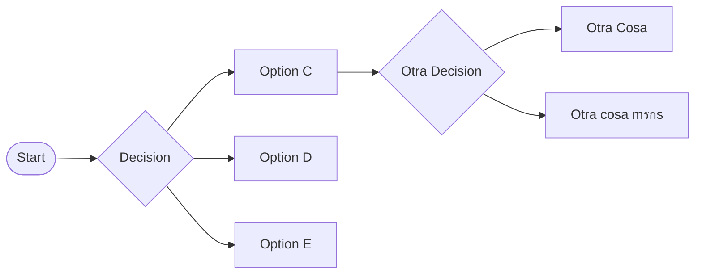

# Taller de Software

## Mermaid en Markdown

```mermaid
flowchart LR
    A(["Start"])
    A --> B{"Decision"}
    B --> C["Option C"]
    B --> D["Option D"]
    B --> E["Option E"]
    C --> F{"Otra Decision"}
    F --> G[Otra Cosa]
    F --> H[Otra cosa mรกs]
```